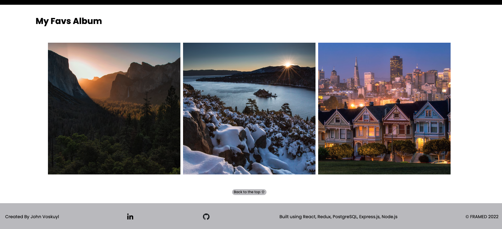

# Welcome to FRAMED!

Using the FRAMED app, you can scroll the roll of photos to your heart's content, add images that you want to share with the world and comment on any image in the roll. Additionally, users have the ability to create albums to store photos that they themselves posts for quck and easy access. Find inspiration, enjoy the beauty of world and share some of your best work!

The FRAMED app welcomes photographers of all different skill levels to share their snapshots of the world through a lense. Get out there in the world and show us what an image can look like! Report back and post your image ;)

Checkout the Framed here: https://framed-app.herokuapp.com/

## FRAMED User Guide


On the top right of the page, in the nav bar, you can find "Log In", "Sign Up" and "Demo User". Using the "Log In" link you will be redirected to the "Log In Page" where you can log in if you have an existing account. If you do not have an existing account, you can create a new account on the "Sign Up Page" using he sign up link.

Additionally, in the nav bar at the top right of the page, you can find a "Demo User" link to log in and test the functionality of the site without creating an account. Check it out!


After you are logged in, you can add an image using the "Add Image" link that will now appear in the nav bar.


 You will additionally see a proile icon that will list you information and a logout button if clicked as well as the "My Albums" link.

When logged in, a user can click on any of the photos located in the roll and see details about the image and who posted it. Logged in users can additionally, add comments to any image. Of course a user can edit or delete their own comments but not comments posted by another user.


If a user added an image to the scroll yourself, you can edit this image or remove it from the roll completely.


You can see that a user that posted an image as the ability to add their photo to an customizable album.


On the "My Albums" page, a user can create an album which gives them the ablility to add their own images to any album that the user had previously created. All album titles can be clicked on and will navigate the user to single album.



Each image on the specific album is a clickable link for easy access for editing.

At the bottom of the page you can find links to my LinkedIn and GitHub profiles.

## List of Technologies Used

### PERN STACK

- Javascript
- React
- Express.js
- Redux
- Node.js
- PostgreSQL
- SEQEULIZE
- CSS
- HTML

## Features of FRAMED

- Sign-In/Log-In with user creditionals
- Demo User
- Create, read, update, and delete Images with error handling
  - Images uploaded utilizing AWS
- Create, read, updated and delete Comments with error handling
- Create, read, update and delete Albums
  - Add images posted by the user to personally crafted albums


## Future To-Dos

- Albums/Images, ability to remove images from an album
- Favorites
- Tags
- Google Maps

## Local Set Up

1) Clone the repo, cd into the backend directory and run "npm install"
2) Create a .env file in the root of your backend directory, refer to the .env.example for reference
3) Create a database user (with createDB) using the same information you wrote inside of your .env file
4) After that you will want to run "npx dotenv sequelize-cli db:migrate" and then "npx dotenv sequelize-cli db:seed:all" 
5) While still in your backend directory run "npm start"
6) cd into the frontend directory and run "npm install"
7) The app will then open up automatically on localhost:3000

## Technical Implementation Details

I spent extra time making sure that my database was planned out properly before getting into the code. This was an important lesson I learned from my first a/A project.

Conditionally rendering certain buttons or components was something that I really felt comfortable with by the end of this project. Below is a quick same of some code from one of my components to make sure that only certain buttons or options appeared if you have the appropriate credentials.

```
 <div className="image-detail">
      </img>
      <div className="image-details-end">
        {content}
        {!showEditForm && showEditButton && <button id="image-edit-button" onClick={goToEditPage}>Edit Image</button>}
        {!showEditForm && showDeleteButton && <button type="button" onClick={handleDeleteImage}>Delete Image</button>}
        <CommentComponent />
        {!showEditForm && showAddCommentButton && <button id="add-comment-button" type="button" onClick={handleAddComment}>Add Comment</button>}
        {showAddComment && <AddCommentComponent setShowAddComment={setShowAddComment} setShowAddCommentButton={setShowAddCommentButton} />}
      </div>
    </div>
```

A very small but surprisingly difficult thing that I ran into during this project was rendering the footer on all pages and mobile. My final fix was to dynamically added classes to the footer on certain pages to achieve my desired output. This allowed me to have different styling for the footer on different pages while still have overall styles for the footer for consistency.

```
let footer = document.querySelector(".footer");
if (footer) {
footer.classList.remove("footer-position");
}
```
